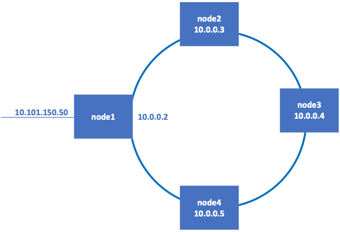

\newpage

# État de l'art de l'infrastructure

Dans cette première partie de l'état de l'art, sera présenté les différents outils utilisés par les étudiants et mis à disposition par l'enseignant au cours de l'année scolaire 2023-2024 dans le cadre du cours AI145BB sera présentée.

## Proxmox

Proxmox est un hyperviseur open source destiné à la gestion de serveurs de virtualisation pour les entreprises. Celui-ci est basé sur la distribution Debian et utilise KVM pour provisionner des machines virtuelles. Il est également possible de créer des conteneurs LXC. Son interface web permet de gérer les différentes machines virtuelles et conteneurs, ainsi que de surveiller les ressources utilisées par ces derniers. [@proxmox]

## Hadoop

Hadoop est un framework open source permettant de stocker et de traiter de grandes quantités de données. Il est basé sur le système de fichiers distribué HDFS(Hadoop Distributed File System)[^1] et a été programmé grâce au langage Java. Celui-ci est composé de plusieurs modules, dont HDFS, MapReduce ... Il est utilisé par de nombreuses entreprises pour le traitement de données en masse. [@hadoop] Dans le cadre du cours AI145BB, les étudiants ont eu accès à un cluster Hadoop composé de 4 machines virtuelles Centos 7.9. Celles-ci sont gérées par l'hyperviseur Proxmox sur un seul serveur physique.

[^1]: HDFS (Hadoop Distributed File System) : Système de fichiers distribué utilisé par Hadoop pour stocker de grandes quantités de données.

{ width=50% }

\newpage

## Visual Studio Code

Visual Studio Code est un éditeur de code open source développé par Microsoft. Cet éditeur est disponible sur de nombreuses plateformes, dont Windows, macOS et Linux. Celui-ci propose de nombreuses fonctionnalités. Celle qui a été fortement utilisée par les étudiants est la possibilité de se connecter à un serveur distant. Il est possible de se connecter à un serveur distant via SSH, ce qui permet de développer des applications sur une machine distante. [@vscode-server]

![Vscode server [@vscode-server]](../figures/code-server-arch.png "Vscode server"){ width=75% }

La figure ci-dessus montre l'architecture utilisée pour l'intégration de Visual Studio Code dans un environnement de développement distant. Celle-ci est composée de plusieurs éléments, le client (Vs Code) qui est installé sur la machine locale de l'utilisateur. Il permet à l'utilisateur de visualiser et de modifier les fichiers présents sur le serveur. La partie à distance (Remote) est composée de l'exécutable de Visual Studio Code server. Celui-ci est installé sur le serveur distant et permet de gérer les fichiers et les extensions installées. Ce binaire lance plusieurs processus : un terminal, un debugger et l'application elle-même. [@vscode-server] Cette architecture est celle utilisée par l'extension Remote - SSH de Visual Studio Code.

Il est aussi possible de créer des environnements de développement à distance avec Visual Studio Code serveur web. Celui-ci sera similaire à [vscode.dev](https://vscode.dev) mais hébergé sur un serveur privé.

\newpage

## Jetbrains server

Jetbrains propose une suite d'outils de développement pour les développeurs. Celle-ci se compose de plusieurs outils, tels que IntelliJ IDEA, PyCharm, WebStorm, ... Ces outils sont disponibles sur Windows, macOS et Linux. Cette suite propose une fonctionnalité de développement à distance. [@jetbrains-remote]

![Jetbrains server [@jetbrains-remote]](../figures/jetbrains-remote.png){ width=75% }

La figure ci-dessus montre l'architecture utilisée par les différents outils proposés par Jetbrains. Il y a deux éléments principaux, le client qui est installé sur la machine de l'utilisateur et le "IDE Backend" qui est installé sur le serveur. Le client permet la visualisation et la modification des fichiers présents sur le serveur. Pour ce faire, il communique à travers une Gateway. L'"IDE Backend" gère les fichiers et les extensions installées ainsi que les LSP (Language Server Protocol).[@jetbrains-remote]

## Centos 7.9 2009

Centos est l'acronyme de Community ENTerprise Operating System. C'est une distribution Linux basée sur Red Hat Enterprise Linux (RHEL). Celle-ci est utilisée par de nombreuses entreprises pour des applications critiques. Centos 7.9 est la dernière version de la branche 7 de Centos. Celle-ci est supportée jusqu'en 2024. [@centos]

## Conclusion

Au cours de l'année scolaire 2023-2024, les étudiants ont utilisé différents éditeurs de code à distance pour développer des solutions Big Data sur un cluster Hadoop. Ce cluster est composé de 4 machines virtuelles Centos 7.9 qui sont gérées par l'hyperviseur Proxmox sur un seul serveur physique. Les étudiants ont utilisé les outils de développement à distance de Visual Studio Code et de Jetbrains pour développer leurs solutions. Malheureusement, l'absence de monitoring de l'infrastructure a conduit à des problèmes de performance et de disponibilité des ressources. Il est donc nécessaire de mettre en place un système de monitoring et de test de charge pour prévenir ces situations.

\newpage

# Monitoring

Le monitoring est une pratique qui consiste à surveiller les ressources d'un système informatique. Celui-ci permet de détecter les problèmes avant qu'ils n'impactent les utilisateurs.

Un système de monitoring est composé de plusieurs éléments. Le premier est l'agent qui collecte les métriques. Celui-ci est installé sur les machines à surveiller. Le second est le stockage des métriques de manière persistante et temporelle. Le troisième est l'interface de visualisation des métriques.

Actuellement, l'utilisateur utilise le monitoring de Proxmox pour surveiller les ressources des machines virtuelles. Celui-ci est limité et ne permet pas d'avoir une vue d'ensemble de l'infrastructure.

{ width=75% }

Après l'implémentation d'un système de monitoring, l'architecture sera la suivante avec les éléments ajoutés ou modifiés en bleu.

{ width=75% }

Dans le meilleur des cas, le serveur de monitoring devrait être installé sur une machine dédiée. Cela permet de ne pas impacter les performances des machines à surveiller et que le monitoring soit toujours disponibles même si le serveur qui héberge les machines est surchargé. Malheureusement, dans le cadre de ce projet, il n'est pas possible d'ajouter une machine dédiée pour le monitoring. Elle sera donc une machine virtuelle provisionnée par Proxmox.

## Agrégation des données

Pour l'agrégation des données, plusieurs solutions sont possibles. Étant donné que Proxmox propose un exporteur de métriques pour Graphite et InfluxDB, ces deux solutions sont à analyser. Prometheus étant un outil de monitoring très populaire, il est aussi à prendre en compte.

### Prometheus

Prometheus est un outil open source de monitoring et d'alerting. Il permet la collecte de métriques à partir de cibles configurées. Il stocke ces métriques sous forme de séries temporelles. Il met à disposition un langage de requête très puissant nommé PromQL. Celui-ci propose de nombreuses interactions avec docker, JMX, ... [@prometheus]

### InfluxDB

InfluxDB est une base de données de séries temporelles open source. L'interaction avec les données se fait avec un langage proche du SQL ainsi qu'une API accessible via HTTP. Sa version 3.0 propose des améliorations majeures en termes de rapidité de stockage et de requête. [@influxdb]

### Graphite

Graphite est un outil de surveillance d'entreprise conçu pour fonctionner efficacement sur du matériel bon marché ou sur une infrastructure Cloud. Il est utilisé par les équipes pour suivre les performances de leurs sites web, applications, services métier et serveurs en réseau, marquant ainsi le début d'une nouvelle génération d'outils de surveillance facilitant le stockage, la récupération, le partage et la visualisation des données temporelles. Créé en 2006 par Chris Davis chez Orbitz comme un projet secondaire, Graphite est devenu leur outil de surveillance de base. En 2008, il a été publié sous la licence open source Apache 2.0 par Orbitz. De nombreuses grandes entreprises l'ont adopté pour surveiller leurs services de commerce électronique en production et planifier leur croissance.

### Comparaison

Il est important de comparer les différentes solutions pour choisir la plus adaptée à l'infrastructure. Pour cela, il est nécessaire de prendre en compte plusieurs critères. Le choix de ces critères se base sur les besoins analysés pour l'infrastructure. Pour trouver les causes des problèmes de performance et de disponibilité des ressources, il est nécessaire de surveiller les ressources des machines virtuelles, les systèmes d'exploitation et les applications. Un plus serait de pouvoir mettre en place un système d'alerting pour prévenir les problèmes avant qu'ils n'impactent les utilisateurs. La facilité d'installation et de configuration avec Ansible est aussi un critère important pour automatiser le déploiement dans l'infrastructure. Pour finir, la qualité de la documentation et le support communautaire et professionnel sont un bon indicateur de la pérennité de la solution.

Une comparaison des différentes solutions est présentée dans le tableau ci-dessous.

| Note sur 5                             | Coefficient d'importance | InfluxDB | Prometheus | Graphite   |
| -------------------------------------- | ------------------------ | -------- | ---------- | ---------- |
| Language de requête                    | /////                    | InfluxQL | PromQL     | Pas de nom |
| Exporteur Proxmox                      | 2                        | 5        | 4          | 5          |
| Exporteur JMX                          | 1                        | 3        | 4          | 3          |
| Exporteur Linux                        | 2                        | 2        | 5          | 4          |
| Compatibilité avec Ansible             | 1                        | 3        | 5          | 3          |
| Alerting                               | 1                        | 5        | 5          | 5          |
| Documentation                          | 1                        | 4        | 5          | 4          |
| Support communautaire et professionnel | 1                        | 3        | 5          | 4          |
| Total                                  | /////                    | 32/45    | 43/45      | 37/45      |

Les notes sont données sur une échelle de 1 à 5, 1 étant la moins bonne note et 5 la meilleure. Les critères de comparaison sont les suivants :

- Langage de requête : La facilité d'utilisation du langage de requête.
- Exporteur Proxmox : La qualité et présence d'un exporteur de métriques pour Proxmox (1 = absent, 5 = très bon).
- Exporteur JMX : La qualité et présence d'un exporteur de métriques pour JMX[^2] (1 = absent, 5 = très bon).
- Exporteur Linux : La qualité et présence d'un exporteur de métriques pour les métriques système Linux (1 = absent, 5 = très bon).
- Compatibilité avec Ansible : La facilité d'installation et de configuration avec Ansible (1 = difficile, 5 = facile).
- Alerting : La présence d'un système d'alerting natif et sa facilité d'utilisation (1 = absent, 5 = très bon).
- Documentation : La qualité de la documentation (1 = mauvaise, 5 = très bonne).
- Support communautaire et professionnel : La représentation de la communauté et son utilisation par des entreprises.

[^2]: JMX (Java Management Extensions) : Technologie Java qui fournit des outils pour la gestion et la surveillance d'applications Java.

Le choix de la solution se porte sur Prometheus. Celui-ci est très complet et propose une solution d'alerting native. Il est aussi très bien documenté et utilisé par de nombreuses entreprises. Il est aussi très facile à installer et à configurer avec Ansible. De plus, celui-ci possède un meilleur exporteur pour Linux que InfluxDB et Graphite.

## Affichage de donnée

### Grafana

Grafana est un outil open source de visualisation et d'analyse de métriques. Il permet de créer des tableaux de bord en utilisant différentes sources de données. Les tableaux créés sont personnalisables et peuvent être partagés avec d'autres utilisateurs.

### Signoz

Signoz est une plateforme open source de monitoring, celle-ci permet de surveiller les différentes applications et services. Il est possible de créer des tableaux de bord pour visualiser les métriques.

### Kibana

Kibana est un outil de visualisation de données open source. Il permet la création de tableaux de bord pour visualiser les données stockées dans Elasticsearch.

|                              | Grafana    | Signoz     | Kibana                                              |
| ---------------------------- | ---------- | ---------- | --------------------------------------------------- |
| Source de données            | Multiple   | Multiple   | Elasticsearch                                       |
| Alerting                     | Natif      | 5          | Utilise Watcher                                     |
| Liscence                     | Apache 2.0 | Apache 2.0 | Elastic License & Server Side Public License (SSPL) |
| Customisation des dashboards | Haut       | Moyenne    | Moyenne                                             |
| Ansible                      | Facile     | Moyen      | Moyen                                               |
| Documentation                | Très bonne | Moyenne    | Moyenne                                             |
| Support communautaire        | Très bon   | Bon        | Moyen                                               |

Après comparaison des différentes solutions, Grafana et Signoz sont les deux solutions qui ressortent le plus. Néanmoins, Grafana est plus complet et plus utilisé par les entreprises. Il est aussi plus facile à installer et à configurer avec Ansible. Il est donc choisi pour l'affichage des métriques.

# Test de charge

Il existe une multitude de solutions pour tester la charge d'une application ou simuler des utilisateurs. Elles ont pour but de vérifier les performances de l'application et de détecter les problèmes avant qu'ils n'impactent les utilisateurs. Néanmoins, la plupart des solutions partent du postulat que l'application est connue du développeur. Dans le cadre de ce projet, l'applicatif est inconnu. Le type de requête, leurs contenus, leurs fréquences ... sont inconnus. Il est donc nécessaire de mettre en place un système de test de charge qui permet de tester l'application sans connaître son fonctionnement. Pour cela, une approche serait d'utiliser l'application comme un véritable utilisateur. Cela permet de tester l'application dans des conditions réelles.

Utiliser l'application comme un véritable utilisateur n'est pas une tâche simple. En effet, il faut simuler les temps de réflexion, les temps d'écriture, les temps de lecture ... Pour obtenir un résultat fiable, il serait idéal d'enregistrer les actions de l'utilisateur et de les rejouer. Cela permet de simuler un utilisateur réel. Une solution pour cela est le RPA (Robotic Process Automation). Celle-ci permet d'enregistrer les actions de l'utilisateur et de les rejouer. Néanmoins, cette solution utilise la souris et le clavier pour effectuer les actions. Il serait donc nécessaire d'avoir autant de machines virtuelles que d'utilisateurs pour tester l'application. Cela est peu pratique. La solution finale sera présentée dans la partie suivante.
