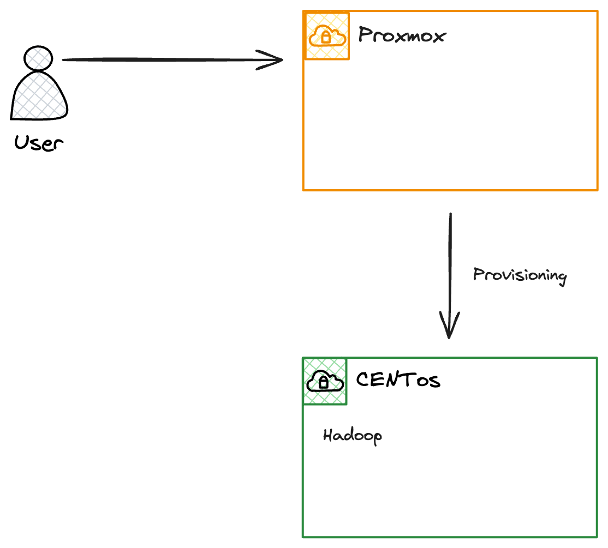
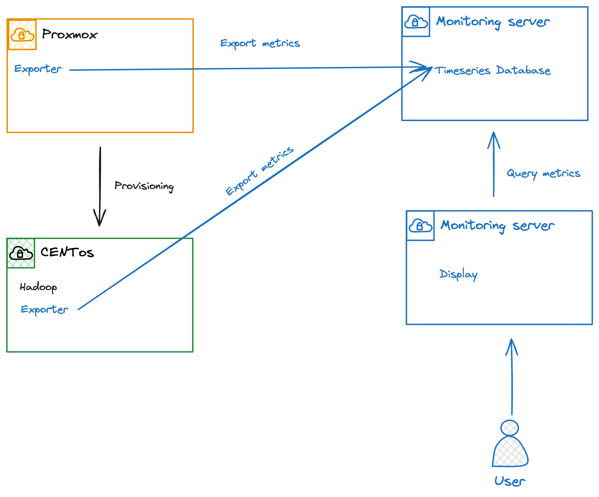

\newpage

# État de l'art de l'infrastructure

Dans cette première partie de l'état de l'art, la présentation des différents outils utilisés par les étudiants et mis à disposition par l'enseignant au cours de l'année scolaire 2023-2024 dans le cadre du cours AI145BB sera présentée.

## Proxmox

Proxmox est un hyperviseur open source destiné à la gestion de serveurs de virtualisation pour les entreprises. Celui-ci est basé sur la distribution Debian et utilise KVM pour provisionner des machines virtuelles. Il est également possible de créer des conteneurs LXC. Son interface web permet de gérer les différentes machines virtuelles et conteneurs, ainsi que de surveiller les ressources utilisées par ces derniers. [@proxmox]

## Hadoop

Hadoop est un framework open source permettant de stocker et de traiter de grandes quantités de données. Il est basé sur le système de fichiers distribué HDFS(Hadoop Distributed File System)[^1] et a été programmé grâce au language Java. Celui-ci est composé de plusieurs modules, dont HDFS, MapReduce, ... Il est utilisé par de nombreuses entreprises pour le traitement de données en masse. [@hadoop] Dans le cadre du cours AI145BB, les étudiants ont eu accès à un cluster Hadoop composé de 4 machines virtuelles Centos 7.9. Celles-ci sont gérées par l'hyperviseur Proxmox sur un seul serveur physique.

![Infrastructure [@cours]](../figures/infrastructure.png){ width=50% }

[^1]: HDFS (Hadoop Distributed File System) : Système de fichiers distribué utilisé par Hadoop pour stocker de grandes quantités de données.

\newpage

## Visual Studio Code

Visual Studio Code est un éditeur de code open source développé par Microsoft. Cette éditeur est disponible sur de nombreuses plateformes, dont Windows, macOS et Linux. Celui-ci propose de nombreuses fonctionnalités. Celle qui a été fortement utilisée par les étudiants est la possibilité de se connecter à un serveur distant. Il est possible de se connecter à un serveur distant via SSH, ce qui permet de développer des applications sur une machine distante. [@vscode-server]

![Vscode server [@vscode-server]](../figures/code-server-arch.png){ width=75% }

La figure si dessus montre l'architecture utilisée pour l'intégration de Visual Studio Code dans un environnement de développement distant. Celle-ci est composée de plusieurs éléments, le client(Vs Code) qui est installé sur la machine local de l'utilisateur. Il permet à l'utilisateur de visualiser et de modifier les fichiers présents sur le serveur. La partie à distance (Remote) est composée de l'éxécutable de Visual Studio Code server. Celui-ci est installé sur le serveur distant et permet de gérer les fichiers et les extensions installées. Ce binaires lance plusieurs processus : un terminal, un debugger et l'application elle-même. [@vscode-server] Cette architecture est celle utilisée par l'extension Remote - SSH de Visual Studio Code.

Il est aussi possible de créer des environnements de développement à distance avec Visual Studio Code server web. Celui-ci sera similaire à [vscode.dev](https://vscode.dev) mais hébergé sur un serveur privé.

\newpage

## Jetbrains server

Jetbrains propose une suite d'outils de développement pour les développeurs. Celle-ci se compose de plusieurs outils, tels que IntelliJ IDEA, PyCharm, WebStorm, ... Ces outils sont disponibles sur Windows, macOS et Linux. Cette suite propose une fonctionnalité de développement à distance. [@jetbrains-remote]

![Jetbrains server [@jetbrains-remote]](../figures/jetbrains-remote.png){ width=75% }

La figure ci-dessus montre l'architecture utilisée par les différents outils proposés par Jetbrains. Il y a deux éléments principaux, le client qui est installé sur la machine de l'utilisateur et le "IDE Backend" qui est installé sur le serveur. Le client permet la visualisation et la modification des fichiers présents sur le serveur. Pour se faire il communique à travers une Gateway. L'"IDE Backend" gère les fichiers et les extensions installées ainsi que les LSP (Language Server Protocol).[@jetbrains-remote]

## Centos 7.9 2009

Centos est l'accronyme de Community ENTerprise Operating System. C'est une distribution Linux basée sur Red Hat Enterprise Linux (RHEL). Celle-ci est utilisée par de nombreuses entreprises pour des applications critiques. Centos 7.9 est la dernière version de la branche 7 de Centos. Celle-ci est supportée jusqu'en 2024. [@centos]

## Conclusion

Au cours de l'année scolaire 2023-2024, les étudiants ont utilisé différents éditeur de code à distance pour développer des solutions Big Data sur un cluster Hadoop. Ce cluster est composé de 4 machines virtuelles Centos 7.9 qui sont gérées par l'hyperviseur Proxmox sur un seul serveur physique. Les étudiants ont utilisé les outils de développement à distance de Visual Studio Code et de Jetbrains pour développer leurs solutions. Malheureusement, l'absence de monitoring de l'infrastructure a conduit à des problèmes de performance et de disponibilité des ressources. Il est donc nécessaire de mettre en place un système de monitoring et de test de charge pour prévenir ces situations.

\newpage

# Monitoring

Le monitoring est une pratique qui consiste à surveiller les ressources d'un système informatique. Celui-ci permet de détecter les problèmes avant qu'ils n'impactent les utilisateurs.

Un système de monitoring est composé de plusieurs éléments. Le premier est l'agent qui collecte les métriques. Celui-ci est installé sur les machines à surveiller. Le second est le stockage des métriques de manière persistante et temporelle. Le troisième est l'interface de visualisation des métriques.

Actullement, l'utilisateur utilise le monitoring de Proxmox pour surveiller les ressources des machines virtuelles. Celui-ci est limité et ne permet pas d'avoir une vue d'ensemble de l'infrastructure.

{ width=75% }

Après l'implémentation d'un système de monitoring, l'architecture sera la suivante avec les éléments ajouté ou modifié en bleu.

{ width=75% }

Dans le meilleur des cas le serveur de monitoring devrait être installé sur une machine dédiée. Cela permet de ne pas impacter les performances des machines à surveiller et que le monitoring soit toujours disponibles même si le serveur qui héberge les machines est surchargé. Malheureusement, dans le cadre de ce projet, il n'est pas possible d'ajouter une machine dédiée pour le monitoring. Elle sera donc une machine virtuelle provisionnée par Proxmox.

## Aggrégation des données

Pour l'aggrégation des données, plusieurs solutions sont possibles. Etant donné que Proxmox propose un exporteur de métriques pour Graphite et InfluxDB, ces deux solutions sont à analyser. Prometheus étant un outil de monitoring très populaire, il est aussi à prendre en compte.

### Prometheus

Prometheus est un outil open source de monitoring et d'alerting. Il permet la collecte de métriques à partir de cibles configurées. Il stocke ces métriques sous forme de séries temporelles. Il met à disposition un langage de requête très puissant nommé PromQL. Celui-ci propose de nombreuses interactions avec docker, JMX, ... [@prometheus]

### InfluxDB

InfluxDB est une base de données de séries temporelles open source. L'interaction avec les données se fait avec un langage proche du SQL ainsi qu'une API accessible via HTTP. Sa version 3.0 propose des améliorations majeurs en terme de rapidité de stockage et de requête. [@influxdb]

### Graphite

### Comparaison

|                            | InfluxDB | Prometheus | Graphite |
| -------------------------- | -------- | ---------- | -------- |
| Popularité                 |          |            |          |
| Language de querry         |          |            |          |
| Metrics server Proxmox     | Oui      | Non        | Oui      |
| Exporteur Proxmox          | Oui      | Oui        | Oui      |
| Exporteur Hadoop           |          |            |          |
| Exporteur Linux            |          |            |          |
| Compatibilité avec Ansible |          |            |          |
| Alerting                   | Oui      | Oui        | Oui      |
| Facilité à maintenir       |          |            |          |

## Affichage de donnée

### Grafana

### Signoz

### Kibana
