\newpage

# Solution proposée

Lien vers le code source de la solution : [https://gitlab.com/DTM-Henallux/MASI/etudiants/sermeus-steven/vsloader](https://gitlab.com/DTM-Henallux/MASI/etudiants/sermeus-steven/vsloader)

## Test de charge

Pour répondre à la problématique, il est compliqué d'utiliser l'application VsCode elle-même de par du code. Cependant, l'application propose d'héberger un serveur web qui permet d'accéder à presque toutes les fonctionnalités de l'application. La manipulation d'une page web est plus simple que la manipulation d'une application de bureau. De ce fait, la solution proposée est de simuler l'utilisation de l'éditeur de code à distance en utilisant un navigateur web. Pour une explication plus détaillée de la différence entre l'extension Remote Development et le code serveur web, veuillez vous référer à l'annexe \ref{appendix:comparaison}.

Pour mieux représenter un étudiant qui utilise cet éditeur de code à distance, il est obligatoire que chaque étudiant simulé installe son propre code serveur. De plus, pour mieux représenter le comportement de l'étudiant, un outil d'enregistrement a été développé pour enregistrer les actions de l'étudiant. Cet outil est appelé "VsRecorder".

Le diagramme ci-dessous montre l'architecture de la solution proposée pour la simulation de l'utilisation de l'éditeur de code à distance. Cette solution est composée de deux parties, la première est l'enregistrement des actions de l'étudiant. Cette partie se passe directement sur la machine de l'étudiant. Cet enregistrement sort un fichier qui contient la liste des actions réalisées par l'étudiant ainsi que le temps qu'il a mis à les réaliser. La deuxième partie de la solution est la simulation, pour ce faire, l'installation de code serveur est réalisée pour chaque étudiant. Une fois l'installation terminée, le code serveur est démarré et une page web est ouverte pour simuler l'utilisation de l'éditeur de code à distance.

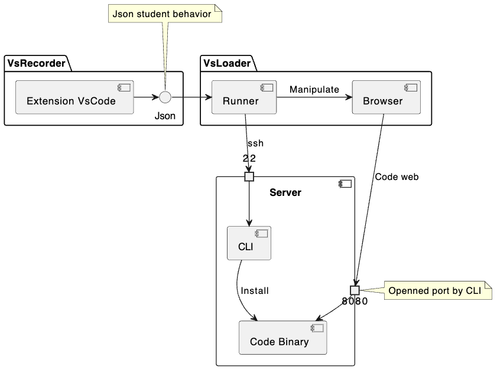{ width=60% }

### Enregistrement des actions de l'étudiant

L'extension met à disposition deux commandes pour enregistrer les actions de l'étudiant. La première commande permet de démarrer l'enregistrement des actions de l'étudiant. La deuxième commande permet de stopper l'enregistrement des actions de l'étudiant. Une fois, l'enregistrement est terminé, un fichier est généré avec les actions de l'étudiant.

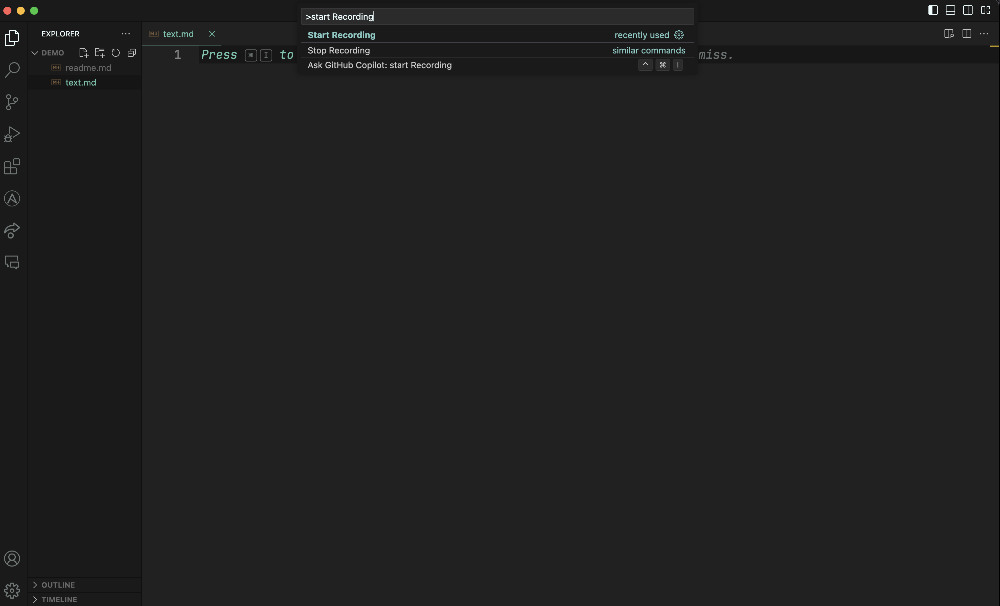

### Simulation de l'utilisation

L'installation et le démarrage de code serveur sont réalisés pour chaque étudiant, le port de code serveur est configurable pour chaque étudiant.

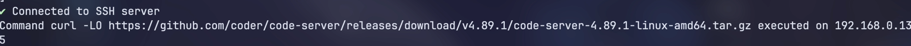


Une fois, le démarrage de code serveur est terminé, il est possible de simuler l'utilisation de l'éditeur de code à distance. Une page web est ouverte et manipulée par du code pour simuler le comportement de l'étudiant qui a été enregistré précédemment par "vsrecorder".

Pour la navigation dans l'éditeur, l'utilisation du raccourci Ctrl + p ou Cmd + p permet d'ouvrir un menu interactif qui permet d'ouvrir et de naviguer dans les fichiers du projet.

L'illustration ci-dessous montre l'ouverture d'un fichier en utilisant le raccourci, en entrant le nom du fichier et en appuyant sur entrée celui-ci s'ouvre dans l'éditeur.

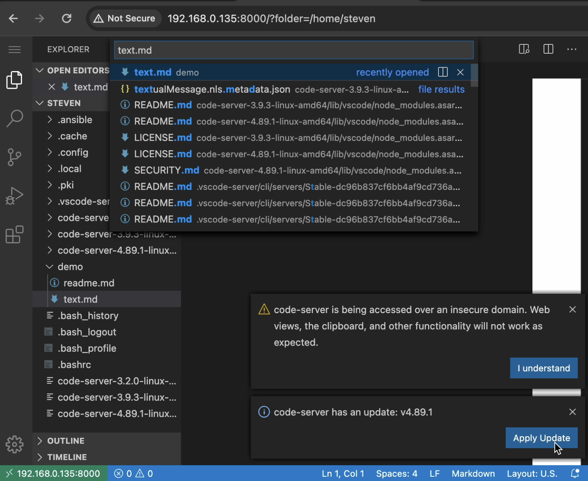{ width=70% }

Il est aussi possible de se déplacer à l'intérieur d'un fichier en utilisant une notation spécifique comme montré ci-dessous. Après cela, on peut écrire le texte à l'endroit où l’on s'est déplacé.

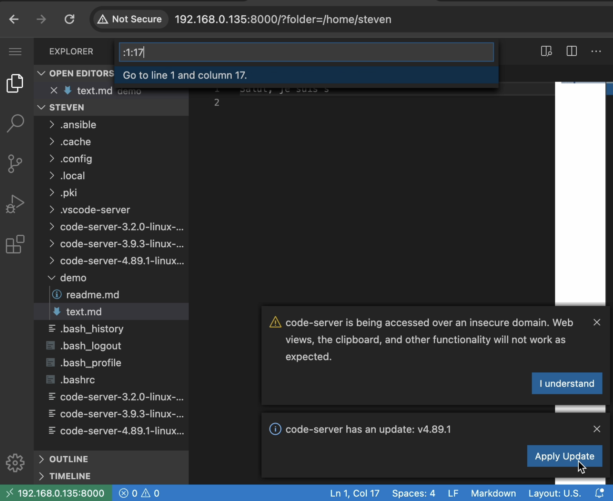{ width=70% }

### Objectif atteint de la solution de test de charge

Ce prototype permet dans un premier temps un enregistrement limité des actions de l'étudiant. Ensuite, il permet de simuler l'utilisation de l'éditeur de code à distance. Les actions de l'étudiant sont réalisées en parallèle. Le temps de pause ou de réflexion de l'étudiant est pris en compte.

### Validation de la solution de test de charge

Pour la validation de la solution, j'ai utilisé VsRecoreder pour enregistrer mes actions sur Visual studio code. Ensuite, j'ai utilisé le fichier généré pour simuler mon utilisation de l'éditeur de code à distance. J'ai pu confirmer que les modifications que j'ai effectuées sur le fichier ont bien été réalisées sur le serveur distant. Le temps que j'ai mis pour réaliser les actions a été enregistré et a été relativement similaire à celui que j'ai mis pour les réaliser. Dans un second temps, j'ai réalisé le même test, mais avec plusieurs étudiants. J'ai pu confirmer que les actions de chaque étudiant ont été réalisées en parallèle en affichant les navigateurs web de chaque étudiant sur un écran partagé.

### Limitations de la solution de test de charge

- Le pare-feu doit être désactivé pour que la solution fonctionne.

- Les tests de charge ne sont pas entièrement décrits par le fichier de configuration. Il est encore nécessaire de modifier le code pour ajouter des étudiants supplémentaires.

```ts
const student = new Student(
	"Student_name",
	"192.168.0.135",
	"username",
	"password",
	6000 // Visual studio code server port
);

const student2 = new Student(
	"Student_name",
	"192.168.0.135",
	"username",
	"password",
	6001 // Visual studio code server port
);
```

- L'ouverture de fichier est limitée, elle se base uniquement sur le nom et pas le chemin du fichier. De ce fait, si plusieurs fichiers avec le même nom existent dans le projet, il est possible que le fichier ouvert ne soit pas celui attendu.

- Visual studio code s'ouvre dans le répertoire home de l'utilisateur et non dans le répertoire du projet.

- Les fichiers édités doivent être présents sur le serveur distant.

- En fonction de la performance du navigateur web, il est possible que la simulation échoue, car des actions sont réalisées trop rapidement.

### Amélioration de la solution de test de charge

- Télécopier les fichiers du projet de l'étudiant sur le serveur distant.

- Ouvrir Visual studio code dans le répertoire du projet.

- Ajouter une fonctionnalité pour ouvrir un fichier en utilisant son chemin complet.

- Fixer les différents problèmes cités dans les limitations.

- Permettre l'installation d'extension pour chaque étudiant.

## Monitoring

Les technologies de monitoring qui ont été sélectionnées sont les suivantes, Prometheus pour la collecte des métriques. Grafana pour la visualisation des métriques. Et les différents exporters de métriques proposés par Prometheus pour la collecte des métriques. Le tout sera installé en utilisant Ansible. L'architecture de monitoring sera la suivante.

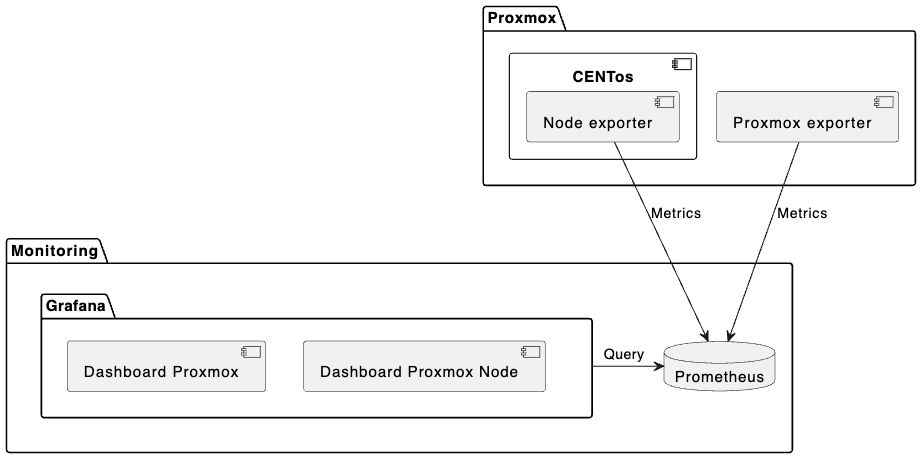

### Monitoring Proxmox VE

Le monitoring au niveau de Proxmox VE est celui avec le moins de granularité. Il permet de voir l'état des machines virtuelles, l'utilisation des ressources de base telles que le CPU, le disque et le réseau. Il donne aussi une vue sur l'utilisation de la machine hôte de l'hyperviseur.

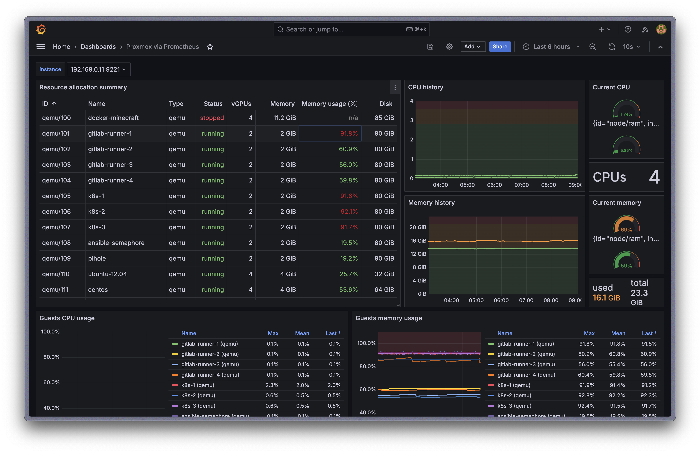{ width=60% }

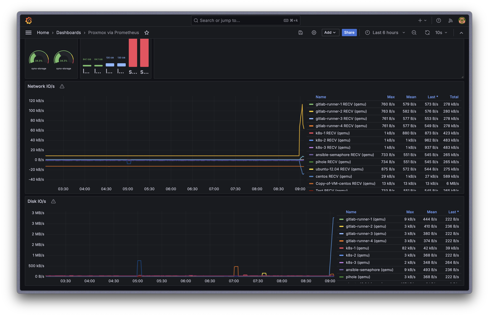{ width=60% }

### Monitoring Linux

Le monitoring au niveau de Linux est plus granulaire que celui de Proxmox VE. Il permet des fonctionnalités supplémentaires telles que la visualisation par interface réseau du trafic réseau, la visualisation de l'utilisation du disque par partition, le nombre de fichiers ouverts, etc. Ce tableau de bord permet de voir l'état de la machine virtuelle de manière plus détaillée et de voir les problèmes potentiels au niveau de l'OS et ressource de la machine virtuelle.

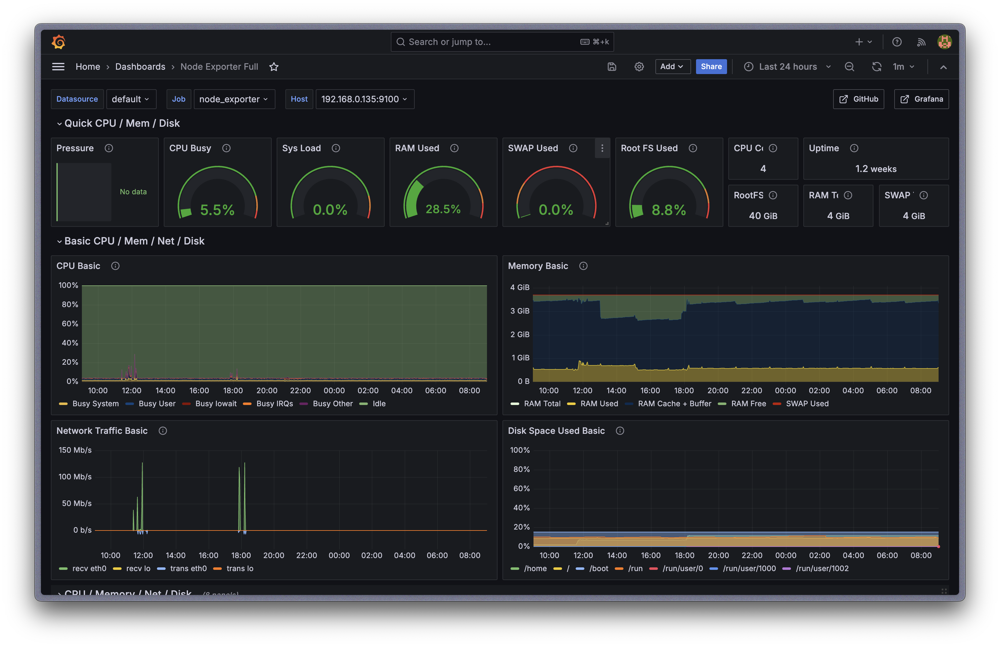{ width=60% }

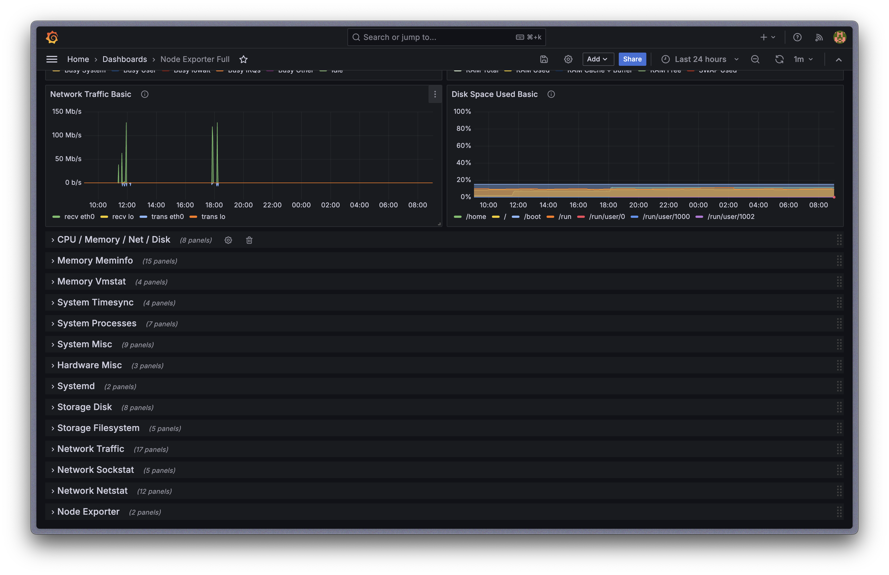{ width=60% }

### Monitoring par processus

Avec ce tableau de bord, il est possible d'avoir des informations précises sur chaque processus qui tourne sur la machine virtuelle. Il est possible de voir l'utilisation des ressources par processus, le nombre de fichiers ouverts, les pages fault[^3] et les context switch[^4].

[^3]: En Linux, une page fault est une interruption générée par le processeur lorsqu'un programme tente d'accéder à une page de mémoire qui n'est pas actuellement chargée en mémoire physique.[@page-faults]
[^4]: Le changement de contexte est le processus consistant à passer le CPU d'un processus, d'une tâche ou d'un thread à un autre. Dans un système d'exploitation multitâche, tel que Linux, le CPU doit alterner entre plusieurs processus ou threads afin d'assurer le bon fonctionnement du système.[@context-switch]

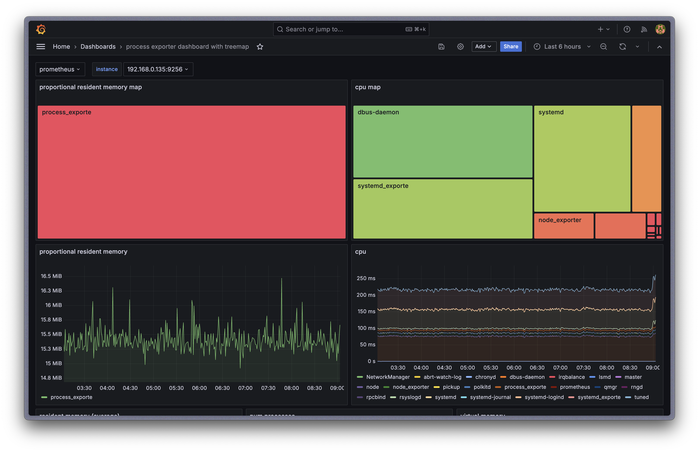{ width=60% }

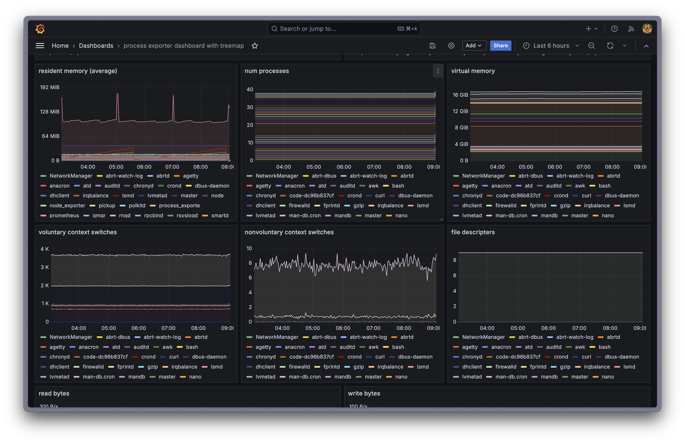{ width=60% }

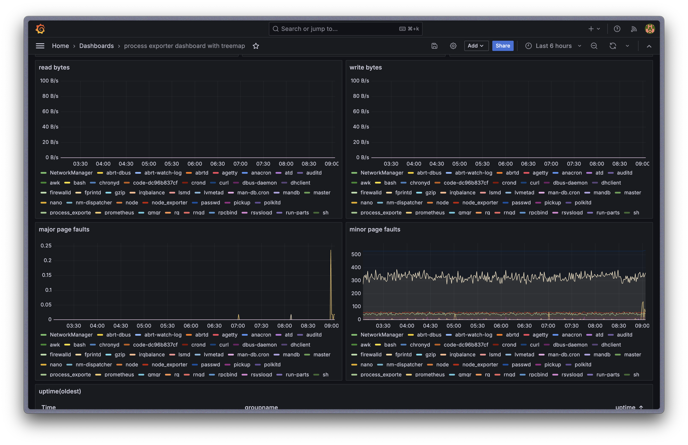{ width=60% }

### Validation de la solution de monitoring

Pour valider que le monitoring fonctionne correctement, j'ai utilisé les tableaux de bord de Grafana pour voir l'utilisation des ressources de la machine virtuelle que j'ai comparée avec l'utilisation reportée sur les machines directement. J'ai aussi créé de la charge sur les machines grâce à un script Python qui utilise la majorité des ressources CPU de la machine. J'ai pu voir que les métriques de Prometheus ont été mises à jour en temps réel et que les tableaux de bord de Grafana ont été mis à jour en conséquence.

### Limitations de la solution de monitoring

- Les mots de passe par défaut sont en clair dans le fichier de configuration. Ceux-ci doivent être changés à la première utilisation.

- Les alertes ne sont pas configurées.

- Les métriques critiques ne sont pas spécialement mises en avant.

- Les métriques spécifiques à Hadoop ne sont pas collectées.

### Amélioration de la solution de monitoring

- Si les mots de passe de passe par défaut sont utilisés comme mot de passe définitif, il est nécessaire d'utiliser les Vault Ansible pour les sécuriser.

- Ajouter des alertes pour les métriques critiques.

- Ajouter un exporter JMX pour Hadoop.

\newpage

# Conclusion

## Résumé des Contributions

Ce travail a présenté le développement et la mise en place d'un outil de simulation de charge et de monitoring pour le cluster Big Data du MASI. Les principales contributions de ce travail sont :

Simulation réaliste de Charge : Un outil capable de simuler de manière fidèle l'utilisation du cluster par une classe d'étudiants, en tenant compte des spécificités des éditeurs de code à distance comme Visual Studio Code et les outils JetBrains.

Optimisation des Performances : Identification des limitations actuelles du cluster en termes de performances et de disponibilité des ressources, et proposition d'améliorations pour optimiser son utilisation.

Système de Monitoring avancé : Déploiement d'un système de monitoring complet utilisant Prometheus et Grafana, permettant une visualisation détaillée et en temps réel des ressources utilisées par le cluster, avec des capacités d'alerte pour prévenir les problèmes potentiels.

## Limites de l'Étude

Malgré les avancées réalisées, ce travail présente certaines limitations :

Simulation partielle : La solution de simulation de charge, bien qu'efficace, nécessite encore des améliorations pour couvrir tous les scénarios d'utilisation possibles et automatiser complètement le processus d'ajout de nouveaux utilisateurs.

Configuration initiale : La configuration initiale du système de monitoring et de simulation de charge nécessite une intervention manuelle pour certaines étapes. De plus, le monitoring applicatif Hadoop n'est pas encore intégré.

## Perspectives d'avenir

Les travaux présentés dans ce travail ouvrent plusieurs perspectives pour des recherches futures :

Analyses avancées : Intégrer des techniques de machine learning pour analyser les données collectées par le système de monitoring et proposer des solutions proactives pour l'optimisation des ressources.

Amélioration de la Simulation : Affiner les enregistrements de comportement des étudiants pour une simulation plus réaliste, et automatiser le processus d'ajout de nouveaux utilisateurs pour une simulation à grande échelle.

## Conclusion générale

Ce travail a démontré l'importance d'un outil efficace de simulation de charge et de monitoring pour optimiser l'utilisation des ressources dans un cluster Big Data académique. Les solutions proposées ont permis de mieux comprendre les limites de l'infrastructure actuelle et d'identifier des pistes d'amélioration pour garantir des performances optimales. En fournissant des outils pratiques et robustes, ce travail contribue à l'amélioration de l'enseignement et de la recherche en Big Data, en offrant aux étudiants et aux chercheurs un environnement de travail plus stable et performant.

L'intégration de ces outils dans l'infrastructure du MASI constitue une avancée significative vers une gestion plus proactive et efficiente des ressources, permettant ainsi de prévenir les problèmes avant qu'ils n'affectent les utilisateurs. Les améliorations futures et les perspectives de recherche continueront de renforcer cette approche, assurant ainsi une infrastructure Big Data toujours plus performante et adaptable aux besoins croissants de l'enseignement et de la recherche.
