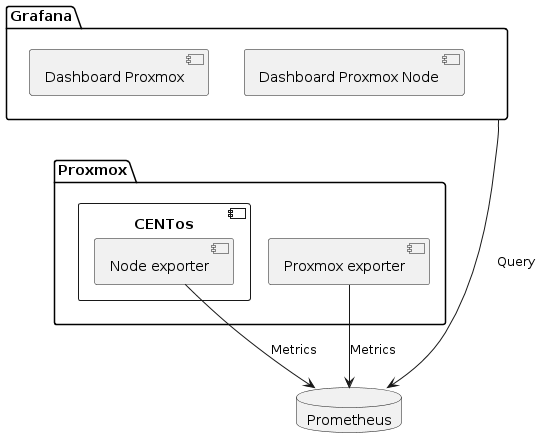

# Analyse de la solution

## Monitoring

### Que surveiller ?

Il existe une multitude de métriques qui permettent de surveiller l'état de santé d'une infrastructure informatique. Celle-ci peuvent être regroupées en deux catégories principales :

- **Métriques système** : CPU, mémoire, disque, réseau, processus, etc.
- **Métriques applicatives** : temps de réponse, nombre de requêtes, etc.

Dans le cadre de ce projet, nous allons nous concentrer sur les métriques système. En effet, l'objectif étant de quantifier l'impact des outils de développement à distance sur les ressources système, il est nécessaire de surveiller ces dernières. Il sera donc important de surveiller les métriques suivantes :

- **CPU** : pour mesurer l'utilisation du processeur
- **Mémoire** : pour mesurer l'utilisation de la mémoire
- **Disque** : pour mesurer l'utilisation du disque
- **Réseau** : pour mesurer l'utilisation du réseau
- **CPU par processus** : pour identifier les processus qui consomment le plus de CPU
- **Mémoire par processus** : pour identifier les processus qui consomment le plus de mémoire

Le schéma ci-dessous illustre l'infrastructure de monitoring que nous allons mettre en place.

{ width=75% }
w

### Installation de Prometheus

### Installation de Grafana

### Installation de PVE Exporter

### Installation de Process Exporter

### Installation de Node Exporter

## Test de charge
