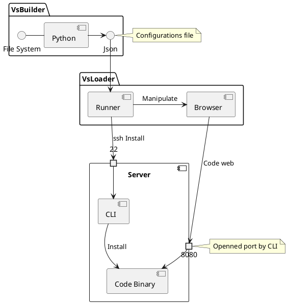

\faIcon{yen-sign}

!include chapters/include-table-of-content.md

\newpage

!include chapters/include-abstract.md

!include chapters/include-glossaire.md

!include chapters/include-introduction.md

!include chapters/include-etat-de-lart.md

!include chapters/include-solution.md

!include chapters/include-table-of-figures.md

!include chapters/include-annexes.md

!include chapters/include-bibliography.md

